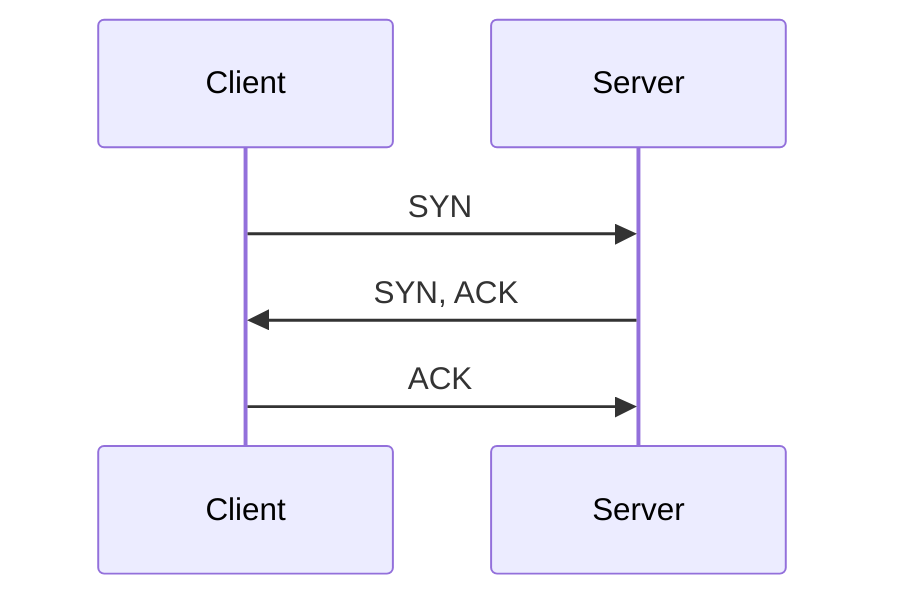

> Transmission Control Protocol

[[verbindungsorientierte Kommunikation]], [[TCP Header]]

- aufgebaut auf [[IP]]
- Kümmert sich um Verbindungsaufbau und -Ende:
	- [[TCP Ablauf]], [[TCP Verbindungsstatus]]
- Garantiert, dass Nachrichten ankommen (oder zumindest man weiß, wenn was nicht ankommt)
- Garantiert eine [[Total Order|Ordnung]] der [[Nachricht|Nachrichten]]
## Verbindungsaufbau

> [!hint] hier kan man [[Protocol DDoS]]en: als [[Client]] den SYN nicht quittieren.

## Datenübertragung als Grafik
- [[ACK]]: Acknowledge
- SYN: Verbindungsaufbau
- FIN: Verbindung beenden
- WIN: wie groß ist meine aktuell noch verfügbare [[Windowing|Window]]-Size (wird jedes mal mitgeschickt)

![[Pasted image 20241114150329.png]]
