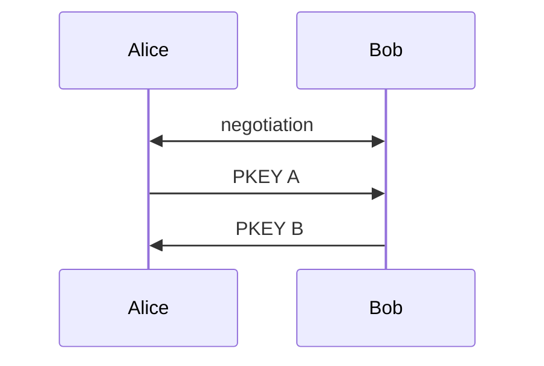

> use two different [[Cryptographic Key|keys]] for en- and decryption

> [!hint] Usually, asymmetric Encryption is used for the exchange of [[symmetric Encryption|symmetric]] [[Cryptographic Key|Keys]].

![[Pasted image 20250424112614.png]]

### Example
- [[RSA]]