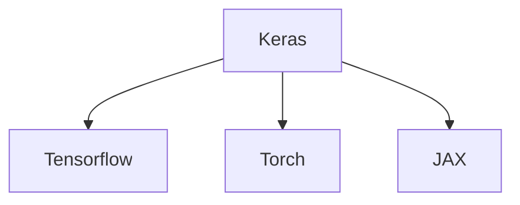

> High-level [[API]] for [[TensorFlow]]

> [!hint]  Is actually the _official_ API for Tensorflow since version 2.x

### Architecture
- [[Keras]] now is a standalone API layer that automatically resolves its Backend:




## Example
- abstract [[Klassifikation]] of a binary dataset

```python
import keras

# 4. Define a simple neural network model in Keras

model = keras.Sequential([
	keras.layers.Input((2,))
	keras.layers.Dense(10, activation='relu'),
	keras.layers.Dense(10, activation='relu'),
	keras.layers.Dense(1, activation='sigmoid')
])

# 5. Compile the model
model.compile(optimizer='adam', loss='binary_crossentropy', metrics=['accuracy'])

# 6. Train the model and capture training history
history = model.fit(X_train, y_train, epochs=30, batch_size=16, validation_split=0.2)
```

![[example.svg]]