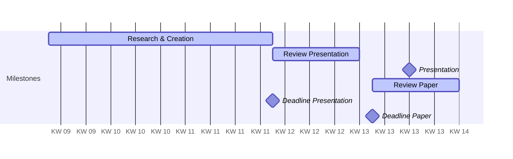

> Version: 1

- DHBW Stuttgart
- Course: Aktuelle DB Architekturen und Technologien, INF23DB
- Instructor: Prof. Dr. Carmen Winter

## Members
- Mika Müller(inf23172@lehre.dhbw-stuttgart.de)
- Emil Schläger (inf23123@lehre.dhbw-stuttgart.de)
- Noemi Soltész (inf23155@lehre.dhbw-stuttgart.de)
- Christian Wortmann (inf23008@lehre.dhbw-stuttgart.de)

## Topics
1. General Introduction to Key-Value Databases (yet unassigned; scheduled dynamically)
2. History and Motivation (Soltész)
	1. placement within CAP theorem
3. General Structure and available APIs (Müller)
4. Pro-Contra, Comparison with other Databases (Wortmann)
	1. comparison with Relational DBs
	2. comparison with other Key-Value DBs
5. Installation & Setup (Schläger)
6. Example - Using Redis for the Data Storage of a Connect-4 Game (Schläger)
	1. Using Redis as a Caching mechanism
	2. Replacing the Relational DB (optional)
7. Conclusion (yet unassigned; scheduled dynamically)
8. Recommendation (yet unassigned; scheduled dynamically)
### Difference Presentation/Paper
- Paper will be more expansive, cover all mentioned aspects in full
- Presentation:
	- Big Focus on Example (Live Demo) -> ca. 1/3
	- Larger Focus on Placement within Product space and Usage recommendation

## Timeline

- Internal Deadlines for peer review:
	- 16.03.: Presentation Slides
	- 24.03.: Paper
- Deadlines:
	- 26.03.: Presentation
	- 02.04.: Submission Paper

## Stack
### Paper
- Latex
- Parallel work is ensured through Overleaf
### Presentation
- PowerPoint
- Parallel work is ensured through OneDrive

## Miscellaneous
- **Grading**: group-based grading