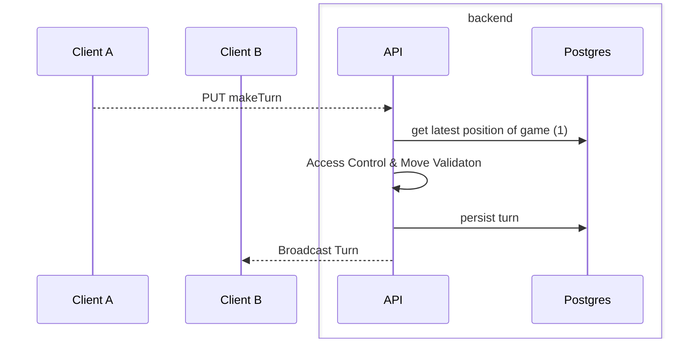
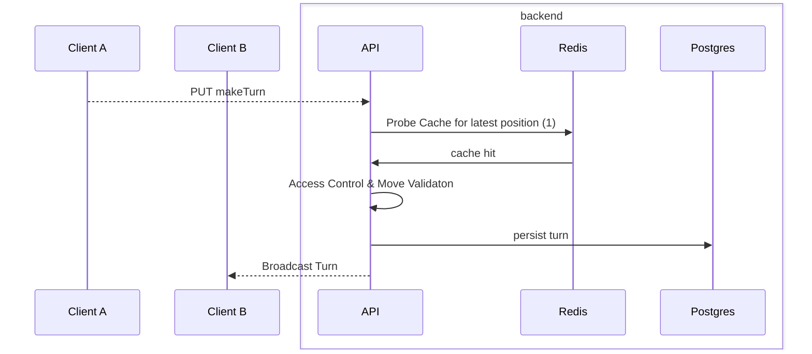

> Everything is Horsey go brrrr in the end

## Installation
### Docker
- ja einfach ne beispiel docker compose geben
- muss in die Präsentation 

### [[Helm]] (because I like helm xd)
- Zeigen, wie man redis in cluster mode startet
- nicht mit application demonstrieren, aber vielleicht mit der cli wenn's geht
- oder: nur im Paper

## Beispiel

### All Queries sent to the [[PostgreSQL]] DB

| What it does       | Statement                                                                                        | When is it invoked                                                     | When to [[Cache Invalidation\|invalidate]] |
| ------------------ | ------------------------------------------------------------------------------------------------ | ---------------------------------------------------------------------- | ------------------------------------------ |
| Get Game History   | `SELECT p FROM Position p WHERE p.game = :game ORDER BY p.turnNumber ASC`                        | Every time a navigation button is pressed, or I navigate to a new game | Everytime a move is made                   |
| Get Games for User | `SELECT g FROM Game g WHERE (host = :user  OR guest = :user) ORDER BY (endTime, startTime) DESC` | Only when reloading the page i think                                   | When the player joins or creates a game    |

> [!hint] Yes with the turns you should use the browser cache because that is the bottleneck but we're doing demonstrations after all

### Realization
- https://quarkus.io/guides/redis (scratch that)
- https://redis.io/docs/latest/develop/clients/jedis/

> [!hint] I'll try to segregate all redis logic from the rest of the application for easy demonstration.

# Paper
## Application Diagram
[[Horsey Websocket Sequence diagram]]

