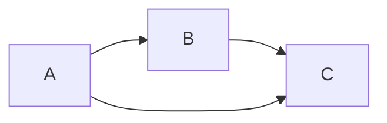

[[gerichteter Graph]]

- jeder [[Knoten]] ist eine [[Zufallsvorgang|Zufalls]]-[[Variable]]
- [[Kante]] repräsentiert den [[Wahrscheinlichkeit|stochastischen]] Zusammenhang zwischen den Variablen
	- aka: eine [[Bedingte Wahrscheinlichkeit|Bedingung]] von Quell- zu Zielknoten

## Beispiel
> [!hint] Umformung ist nur [[Kettenregeln Probability|Produktregel]] sequentiell angewannt

$$p(A, B, C) = p(C|A, B) \cdot p(A, B) = p(C|A, B) \cdot p(B|A) \cdot p(A)$$

