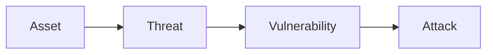

- [[Asset]]s

```mermaid
flowchart LR
Asset --> Threat --> Vulnerability --> Attack
```

- [[Asset]] ist halt n Asset
- Threat: Bedrohung auf ein System (z.B. die Chinesen)
- Vulnerability: [[CVE]]
- Attack: Jemand führt da tatsächlich nen [[Exploit]] durch