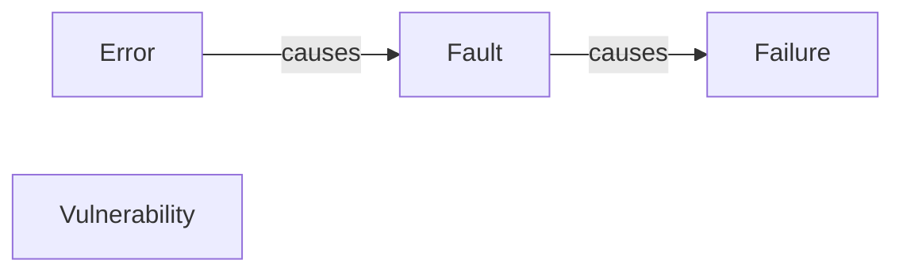

## Failure
- Durch Endnutzer beobachtbar
- z.B.: Absturz von Server
## Fault
- Ursache für einen [[#Failure]]
- z.B.: [[Segmentation Fault]]

> [!hint] Fault Masking: Wenn mehrere Faults existieren, die in Summe so wirken als wäre alles okay.
> Beispiel: [[Floating Point Darstellung|Vorzeichenbit]] flippt zwei mal - net 0.

## Error
- Ursache für einen [[#Fault]]
- Entwickler hat etwas falsch gemacht

## Vulnerability
- Schwachstelle, die von einem Angreifer gezielt ausgenutzt werden kann