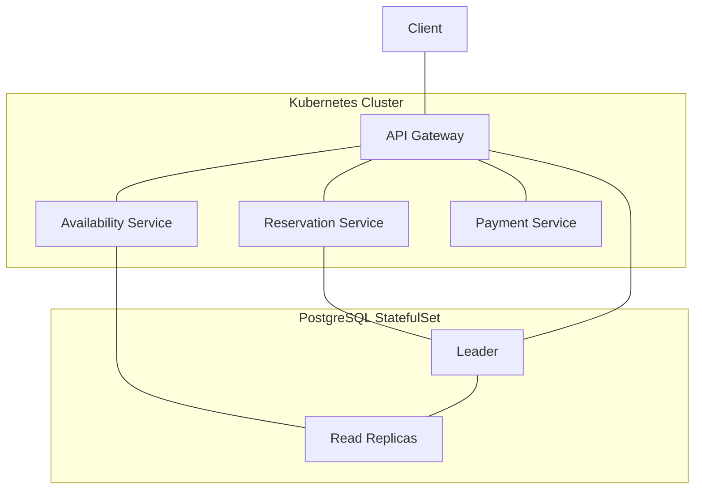

[[Hash]]

>[!question] Wie kann ich in einem [[Peer-to-Peer Network]] Informationen ohne zentralen Koordinator finden?

- Jeder [[Knoten]] ist zuständig für eine [[Menge]] aus [[Schlüssel|Key]]-VAlue-Paaren
	- idR. [[n-m Relation]] zwischen Keys und Knoten
- Suche/Lookup nach Key: 
	- a) [[Recursion|Recursive]] flooding (alle Peers fragen ob sie das kennen) - ineffizient
	- b) wie [[Routing]]: Knoten identifizieren, der _näher_ am Ziel ist, damit der das weiterleiten kann
		- => passiert in [[Logarithmische Laufzeit]] wow

> [!hint] [[Schlüssel]] ist idR ein [[Hash]] (deswegen hash tables)

