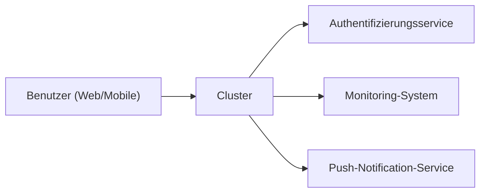

## Funktionale Anforderungen

## Nichtfunktionale Anforderungen
- Konsistenz - Nutzer sehen Nachrichten in der selben Reihenfolge, wie sie gesendet wurden ([[Eventual Consistency]])
- Performance (Latenz)
- Sicherheit/Datenschutz ([[Goals of Cryptography]])
- Skalierbarkeit
- Fehlertoleranz

## System

> [!warning] App Stores, Gesetze, Nutzer, ... sind auch Teil des Systemkontextes